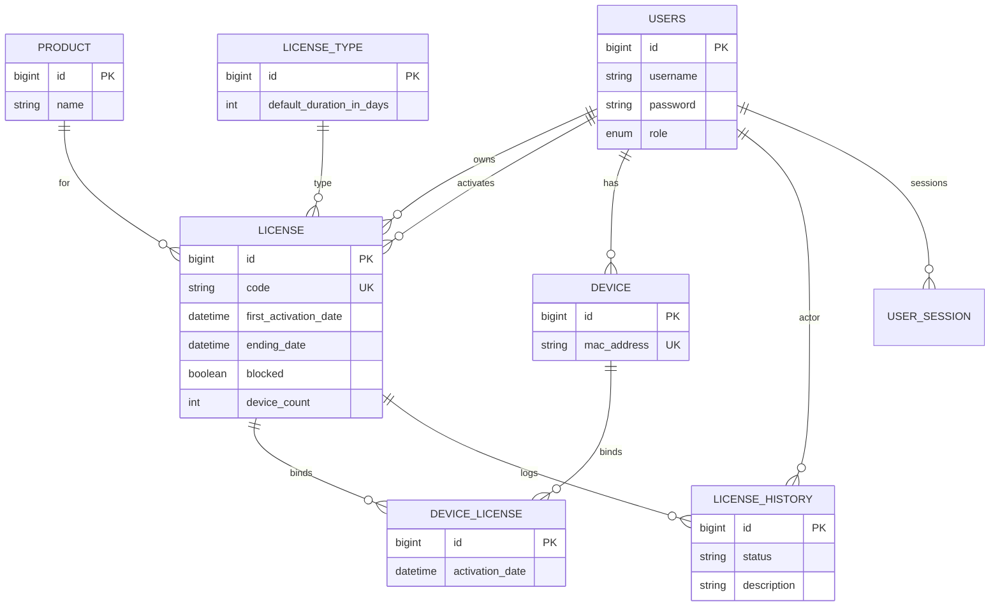
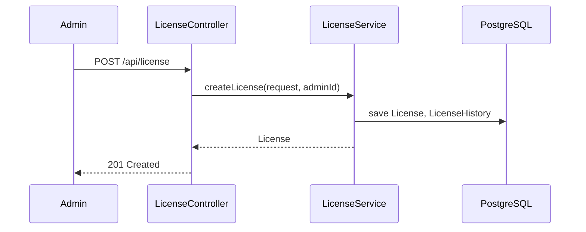
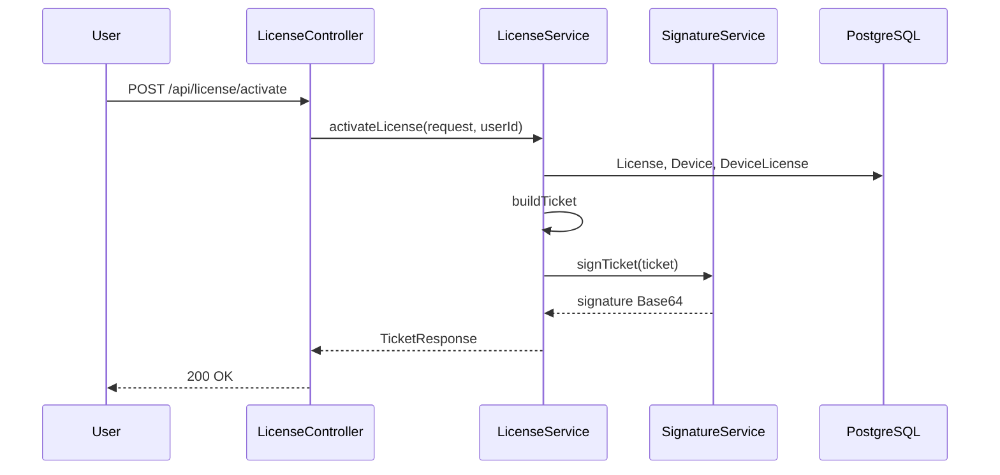
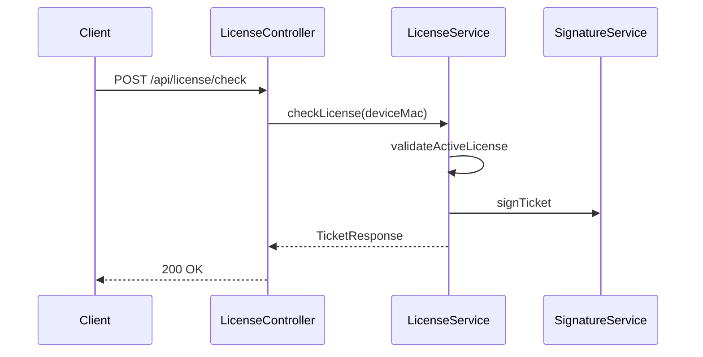
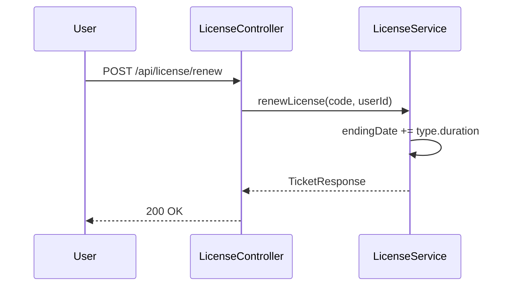

# Лабораторная 2 — лицензирование

Репозиторий: https://github.com/pagadone1/ziovpoLab, ветка **`zadanie2`**  
Тема: ПО автосервиса (Car Service)

## Чеклист (критерии оценки)

| Критерий | Где реализовано |
|----------|-----------------|
| Структура таблиц PostgreSQL по ER | JPA-модели в `models/`, DDL: [schema-license.sql](schema-license.sql) |
| Создание лицензии | `LicenseService.createLicense`, `POST /api/license` (ADMIN) |
| Активация | `LicenseService.activateLicense`, `POST /api/license/activate` |
| Проверка (получение информации) | `LicenseService.checkLicense`, `POST /api/license/check` |
| Продление | `LicenseService.renewLicense`, `POST /api/license/renew` |
| Класс `Ticket` | `dto/Ticket.java` — 7 полей по заданию |
| `TicketResponse` + ЭЦП | `dto/TicketResponse.java`, `SignatureService` (SHA256withRSA, Base64) |

## ER-диаграмма



## Ticket и TicketResponse

**Ticket** (`dto/Ticket.java`):

| Поле | Тип |
|------|-----|
| serverTime | `LocalDateTime` — текущая дата/время сервера |
| ticketLifetimeSeconds | `long` — время жизни тикета |
| firstActivationDate | `LocalDate` — дата активации лицензии |
| expirationDate | `LocalDate` — дата истечения |
| userId | `Long` |
| deviceId | `Long` |
| blocked | `boolean` |

**TicketResponse**: `ticket` + `signature` (ЭЦП тикета в Base64).

Сборка тикета: `LicenseService.buildTicket` → `SignatureService.signTicket`.

## Диаграммы последовательности

### Создание лицензии



### Активация



### Проверка



### Продление



## API (кратко)

Все запросы с JWT (кроме `/api/auth/*`).

```http
POST /api/license              # ADMIN — тело LicenseCreateRequest
POST /api/license/activate     # USER, ADMIN
POST /api/license/check        # USER, ADMIN
POST /api/license/renew        # USER, ADMIN
```

## Запуск

`.env.example` → `.env`, БД `photoprint`, `mvnw spring-boot:run` или CI.

Тесты: `mvnw test -Dspring.profiles.active=test`
