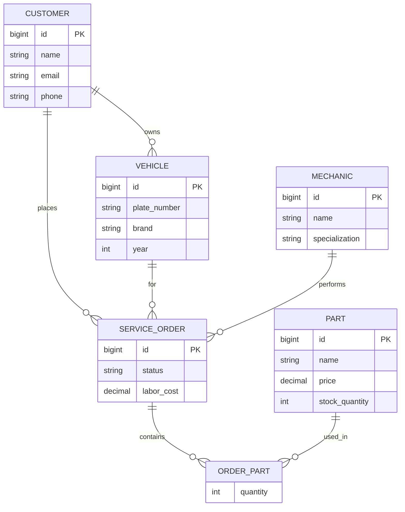

# ER-диаграмма — автосервис

```mermaid
erDiagram
    CUSTOMER ||--o{ VEHICLE : owns
    CUSTOMER ||--o{ SERVICE_ORDER : places
    VEHICLE ||--o{ SERVICE_ORDER : for
    MECHANIC ||--o{ SERVICE_ORDER : performs
    SERVICE_ORDER ||--o{ ORDER_PART : contains
    PART ||--o{ ORDER_PART : used_in

    CUSTOMER {
        bigint id PK
        string name
        string email
        string phone
    }
    VEHICLE {
        bigint id PK
        string plate_number
        string brand
        int year
    }
    MECHANIC {
        bigint id PK
        string name
        string specialization
    }
    PART {
        bigint id PK
        string name
        decimal price
        int stock_quantity
    }
    SERVICE_ORDER {
        bigint id PK
        string status
        decimal labor_cost
    }
    ORDER_PART {
        int quantity
    }
```

Сущности и связи соответствуют проекту `PO6` (Car Service).
