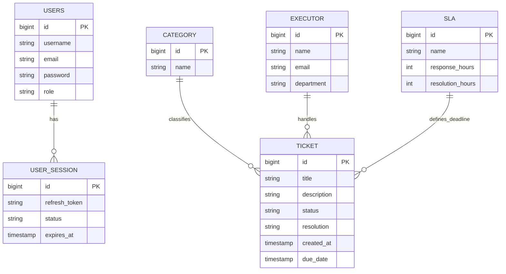

# ER-диаграмма (домен IT Support)

## Основные понятия ER

- **Сущность** — объект предметной области (Ticket, Users).
- **Атрибут** — свойство сущности (title, email).
- **Связь** — отношение между сущностями; кратность: 1:1, 1:N, M:N.

## Схема проекта

## Связи

| Связь | Тип | Описание |
|-------|-----|----------|
| Users → UserSession | 1:N | Сессии refresh-токенов |
| Category → Ticket | 1:N | Категория тикета |
| Executor → Ticket | 1:N | Исполнитель тикета |
| SLA → Ticket | 1:N | SLA для расчёта сроков |

Пользователь (Users) создаёт тикеты через API; в текущей модели JPA связь User–Ticket задаётся на уровне бизнес-логики контроллеров.
