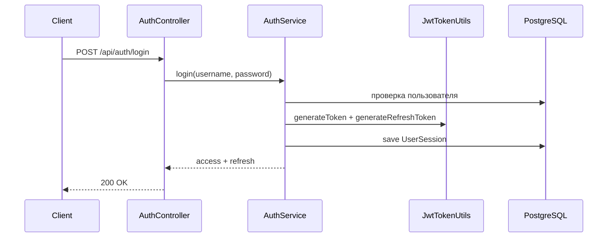

# UML — краткая шпаргалка (лаб. 1)

## Зачем UML

Единый язык для описания системы до и во время разработки: структура, поведение, развёртывание.

## Основные типы диаграмм

| Диаграмма | Назначение |
|-----------|------------|
| **Use Case** | Кто (актор) и что делает с системой |
| **Class** | Классы, поля, связи (наследование, ассоциации) |
| **Sequence** | Порядок вызовов во времени (например, login → JWT) |
| **Activity** | Бизнес-процесс, ветвления |
| **Component** | Модули и зависимости (API, Security, DB) |
| **Deployment** | Серверы, БД, HTTPS |

## Пример для IT Support (Sequence: login)

Для лабораторной 1 достаточно понимать назначение диаграмм; детальные UML по домену — в следующих работах.
