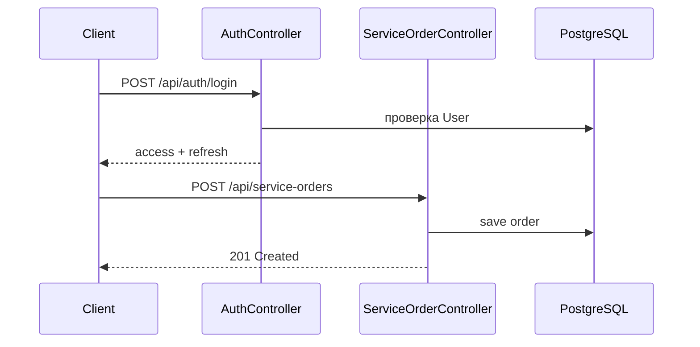

# UML — автосервис

Кратко по типам диаграмм (лаба 1 — теория).

| Диаграмма | Пример для Car Service |
|-----------|-------------------------|
| Use Case | Клиент создаёт заказ, механик закрывает заказ |
| Class | Customer, Vehicle, ServiceOrder |
| Sequence | login → JWT → создание ServiceOrder |
| Component | API, Security, PostgreSQL |

Подробная реализация сценариев — в `PO6/demo`.
